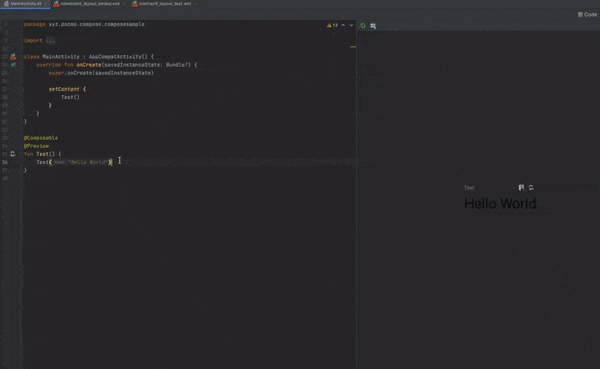

# recompose

recompose is a tool for converting [Android layouts in XML](https://developer.android.com/guide/topics/ui/declaring-layout)
to Kotlin code using [Jetpack Compose](https://developer.android.com/jetpack/compose). It can be used on the command line,
as IntelliJ / Android Studio plugin or as a library in custom code.



## Running

### IntelliJ / Android Studio plugin

The plugin does not get published yet. If you want to try them then you'll have to build them from code. Use the Gradle task `runIde` to run a test IDE with the plugin installed or create an installable plugin with the `buildPlugin` task. The plugin zip will be placed in `recompose-idea/build/distributions/`. To learn how to install it, read the [Install plugin from disk](https://www.jetbrains.com/help/idea/managing-plugins.html#install_plugin_from_disk) section in the IntelliJ docs.

### Command-line interface (CLI)

Like the plugin, the command-line interface does not get published yet. You can run it directly from Gradle via
`./gradlew recompose-cli:run --args="list file paths.."`. Alternatively you can run the `assembleDist` which will place
a zip/tar containing a binary into `recompose-cli/build/distributions/`.

```
Usage: recompose [OPTIONS] INPUT...

Options:
  -o, --output PATH  Output directory for Kotlin code
  -h, --help         Show this message and exit

Arguments:
  INPUT  Layout XML files to convert to Kotlin
```

## Building

Either import the project into [IntelliJ IDEA](https://www.jetbrains.com/idea/) or use [Gradle](https://gradle.org/) on
the command line (via the provided `gradlew` wrapper).

สำหรับ IntelliJ IDEA
ใช้ tab gradle build plugin โดยการกด build ใน recompose-idea/Tasks/build
[](../../../../../var/folders/w0/rhb8ybv567ld4jtbbxh9sbgr0000gn/T/TemporaryItems/NSIRD_screencaptureui_xg5ane/Screen Shot 2565-11-04 at 17.03.22.png)

### Modules

* **recompose-ast**: Contains the data classes for the Abstract Syntax Tree (AST) representing a parsed XML layout.
* **recompose-cli**: A command-line interface (CLI) for running recompose in a shell.
* **recompose-composer**: Responsible for taking an AST and transforming it into the equivalent `Composable` Kotlin code.
* **recompose-idea**: An IntelliJ IDEA / Android Studio plugin that allows copying XML layouts and pasting as
`Composable` Kotlin code.
* **recompose-test**: Contains test data and helpers for unit tests. 

### Important gradle tasks

* **clean**: Deletes the build directories.
* **test**: Runs all unit tests in all modules.
* **runIde**: Runs IntelliJ IDEA with the plugin installed. 
* **buildPlugin**: Builds the IntelliJ / Android Studio plugin and makes it available in `recompose-idea/build/distributions`.

### How does this work?

The [Parser](https://github.com/pocmo/recompose/blob/main/recompose-parser/src/main/kotlin/recompose/parser/Parser.kt) (`recompose-parser`) takes the input XML and transforms it into an
Abstract Syntax Tree (`recompose-ast`). The [Composer](https://github.com/pocmo/recompose/blob/main/recompose-composer/src/main/kotlin/recompose/composer/Composer.kt) (`recompose-composer`)
takes the AST and translates it into Kotlin code calling [Composables](https://developer.android.com/reference/kotlin/androidx/compose/runtime/Composable).

The IntelliJ / Android Studio plugin (`recompose-idea`) uses that to perform the translation when pasting copied XML code. And the CLI (`recompose-cli`) uses it to translate files.

### Can I contribute?

Yes, absolutely. There are a ton of `View`s and attributes to support. The list of issues labeled with [good first issue](https://github.com/pocmo/recompose/issues?q=is%3Aissue+is%3Aopen+label%3A%22good+first+issue%22) are a good place to start. An issue from the list labeled with [help wanted](https://github.com/pocmo/recompose/issues?q=is%3Aissue+is%3Aopen+label%3A%22help+wanted%22) may be a good follow-up. Just comment on any issue that interests you.

## License

```
Copyright 2020 Sebastian Kaspari

Licensed under the Apache License, Version 2.0 (the "License");
you may not use this file except in compliance with the License.
You may obtain a copy of the License at

http://www.apache.org/licenses/LICENSE-2.0

Unless required by applicable law or agreed to in writing, software
distributed under the License is distributed on an "AS IS" BASIS,
WITHOUT WARRANTIES OR CONDITIONS OF ANY KIND, either express or implied.
See the License for the specific language governing permissions and
limitations under the License.
```